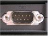

# Hardware component
- 7 fundamental components: 
    - Case
    - Power supply
    - Motherboard
    - CPU
    - RAM
    - Hard disk
    - Graphic card
- **Case:** Houses other hardware component
- **Power supply:** Supply power to all other components in the computer system
- **Motherboard:** The backbone of the computer system. Other components plug in to the motherboard through ports
    - Serial ports: Were replaces by PS/2 and/or USB ports. Only use in specialize application (industrial automation system)    
    
    - PS/2 port: Used to connect peripherals such as keyboard and mouse to the computer. Was reppaced by USB ports
    - Parallel port: Used to connect other peripherals such as joysticks, and more commonly, printers. Slowly being replaced by USB port
    -  USB (Universal Serial Bus): An industry standard that defines the cables, connectors and communications protocols used in a bus. A bus is a communication system that transfers data between components inside a computer, or between computers.
    - Fire wire: This connection medium hoped to surpass USB. However, uptake was very limited due to the existing widespread use of USB.
- **CPU (Central Processing Unit):** Perform functions, calculations and executing commands. 
    - Performance measure
        - Clock speed(Ghz): How many clock cycles per second
        - Core: Multi core and hyper-threading (quad-core, 6-core, 8-core)
    - Steps of operation:
        - Fetch: Retrieve an instruction from program memory
        - Instruction decoder: Instruction is broken up into parts that have significance to other portions of the CPU
        - Execute: Various portions of the CPU, such as the ALU (Arithmetic Logic Unit) and the FPU (Floating Point Unit) are to perform the operation
        - Writeback: Writes the results of the execute step to some form of memory
- **ROM (Read-only memory):** Firmware are loaded from ROM. Firmware is a computer program that is embedded in a hardware device (Eg: microcontroller) 
- **RAM (Random access memory):** Storage is cleared when computer powered-down. Stores programs and files currently in use -> Faster access and reading. Different types include: writable vs. read-only, static vs. dynamic, volatile vs. non-volatile, etc.

- **Hard drive:** Long-term digital storage even when the computer has no power
    - SSD (Solid-State Drive): Most computer use SSD. SSD uses flash memory and semiconductor chips -> Lower failure rate than HHD. SSD can be internal or external (USB, Flash drives)
    - HDD (Hard Disk Drive): Use rotating disks and magnetics
- **Graphics Card:** To see output that a computer system is producing
- **Input and output devices:** 
    - Input: Keyboard, mouse, microphone,...
    - Output: Monitor, printer, speaker,...
- **Removable Media Devices:**
    - CD: Most popular types are
        - CD-ROM (Compact Disc read-only memory)
        - CD-R: Can only be written to once but can be read many times
        - CD-RW (rewritable): Can be written and written to more than once 
    - DVD (Digital Versatile Discs). Like CD, there are many types like DVD-ROM, DVD-R, DVD-RAM,...
    - Blue-ray: Stores high-definition video and data
    - Floppy disk: Being raplaces with optical and flash drive
